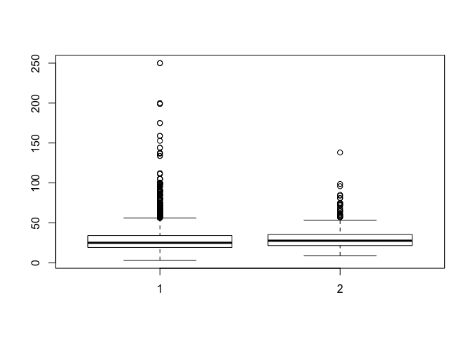

The following output:

After separating the data into green and non-green buildings, we
calculated the mean Rent and mean total rent for both subsets:

    ## [1] 1.70092

    ## [1] 2411698

Results shows there is in fact a difference between the two.
